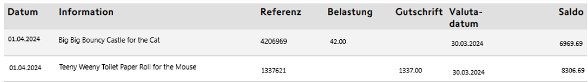
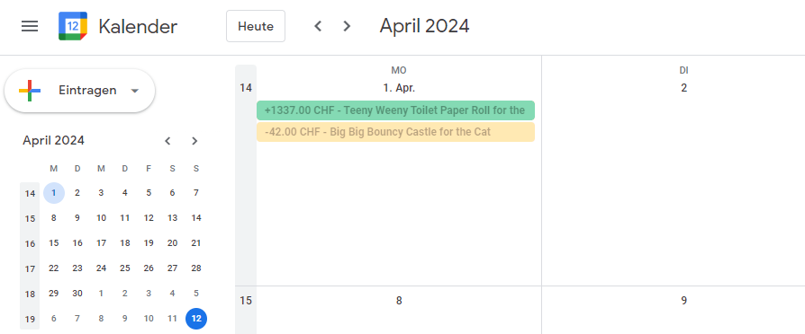

# yuh_finance_calendar

Use this to turn a Yuh Account Overview PDF into calendar entries for use with different services.

## Example
---------------






## Usage

Install Python 3, get the requirements from the requirements.txt file and run any of the conversion scripts, e.g.:

```
    python yuh_to_ics_finance_calendar.py
```

 Make sure set the path to the files as in the provided scripts.

 The ics script will generate an ics file that you can then import to things like Google Calendar etc.

 ----- 

 Short get-me-started:
 - Create a new calendar on Google Calendar so it doesn't interfere with any other calendars (yes, you can have multiple calendars!)
 - Click on dot menu on created calendar on the left side of google calenddar, go to settings and scroll down until you find the calendar ID (something like randomnumbersandletters@group.calendar.google.com)
 - In the root directory of this repo, create a .env file (make sure the "dot" is there!) and add GOOGLE_CALENDAR_ID=randomlettersandnumbers@group.calendar.google.com in there
 - Set up Google Cloud API by going to https://console.cloud.google.com/, signing up/logging in and then clicking on the projects list at the top left (to the right of the Google Cloud logo), add a project in the new window
 - Go to APIs and Services, add the Google Calendar API (it is called exactly that!) by clicking on the plus at the top under "Activated APIs and Services"
 - Get a client_secrets.json file from console.cloud.google.com -> WhateverYouCalledYourProject -> APIs and Services (APIs und Dienste) -> Credentials(?)/Anmeldedaten -> Create OAuth 2.0 key if you're on a new device -> download the json and rename it to client_secrets.json, pull it into the root directory

Now for the fun part:
 - Pull PDFs into /pdfs folder
 - Run script with python yuh_to_google_calendar.py, log in through google stuff, this will generate a token.json file
 - Let it run
 - ???
 - Profit

Whenever you have a new pdf, you can just pull it into the pdfs folder again. The script will check for existing events, so you don't have to delete your old pdfs.
